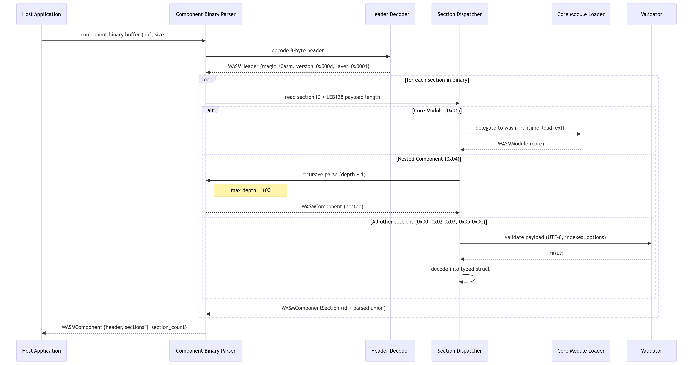
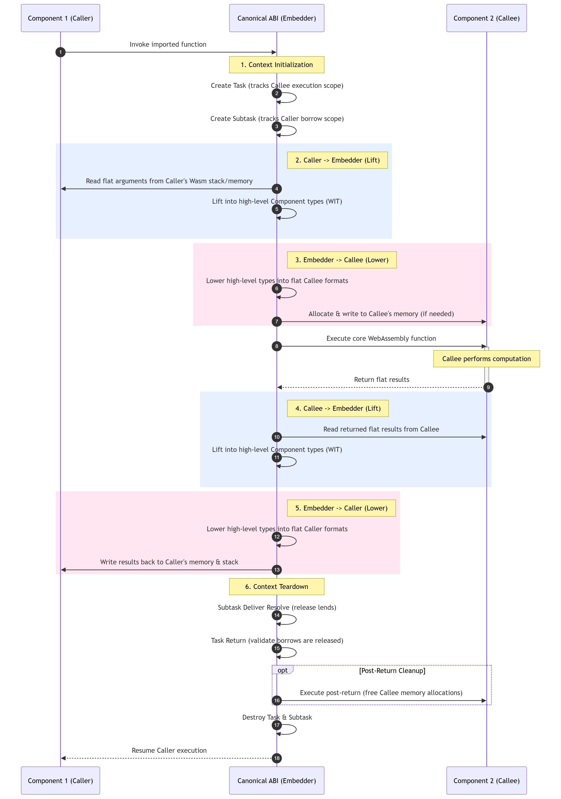

# WAMR Component Model support

## Introduction

A WebAssembly (Wasm) component is an abstraction layer built over [standard WebAssembly](https://webassembly.github.io/spec/core/index.html) (often called WebAssembly Core). It is designed to enrich the exposed type system and improve interoperability across different programming languages and libraries. More details can be found [here](https://component-model.bytecodealliance.org/).

To distinguish between the two layers, the Component Model specification refers to standard WebAssembly entities by prefixing them with the word "core" (e.g., core modules, core functions, core types).

In short, a Wasm component uses WIT—an [Interface Definition Language](https://en.wikipedia.org/wiki/Interface_description_language) (IDL)—to define its public-facing interfaces. It then bundles one or more Wasm core modules to implement the underlying logic behind those interfaces.

WAMR implements binary parsing for the WebAssembly [Component Model](https://github.com/WebAssembly/component-model) proposal. The parser handles the component binary format as defined in the [Binary.md](https://github.com/WebAssembly/component-model/blob/main/design/mvp/Binary.md) specification, covering all 13 section types with validation and error reporting.

References:
- [Component Model design repository](https://github.com/WebAssembly/component-model)
- [Component Model binary format specification](https://github.com/WebAssembly/component-model/blob/main/design/mvp/Binary.md)
- [Canonical ABI specification](https://github.com/WebAssembly/component-model/blob/main/design/mvp/CanonicalABI.md)
- [Build WAMR vmcore](./build_wamr.md) for build flag reference

## Build

Enable the feature by setting the CMake flag `WAMR_BUILD_COMPONENT_MODEL` (enabled by default). This defines the C preprocessor macro `WASM_ENABLE_COMPONENT_MODEL=1`.

```cmake
set (WAMR_BUILD_COMPONENT_MODEL 1)
include (${WAMR_ROOT_DIR}/build-scripts/runtime_lib.cmake)
add_library(vmlib ${WAMR_RUNTIME_LIB_SOURCE})
```

Or pass it on the cmake command line:

```bash
cmake -DWAMR_BUILD_COMPONENT_MODEL=1 ..
```

## Component vs core module

A component binary shares the same magic number (`\0asm`) as a core WebAssembly module but is distinguished by its header fields:

|               | Core module   | Component     |
|---------------|---------------|---------------|
| magic         | `\0asm`       | `\0asm`       |
| version       | `0x0001`      | `0x000d`      |
| layer         | `0x0000`      | `0x0001`      |

WAMR uses `wasm_decode_header()` to read the 8-byte header and `is_wasm_component()` to determine whether a binary is a component or a core module.

## Binary parsing overview

The binary parser takes a raw component binary buffer and produces a `WASMComponent` structure that holds the decoded header and an array of parsed sections. The diagram below illustrates the high-level parsing flow:

<center></img></center>

The parsing proceeds as follows:

1. **Header decode** -- `wasm_decode_header()` reads the 8-byte header (magic, version, layer) and populates a `WASMHeader` struct.
2. **Section loop** -- the parser iterates over the binary, reading a 1-byte section ID and a LEB128-encoded payload length for each section.
3. **Section dispatch** -- based on the section ID, the parser delegates to a dedicated per-section parser. Each parser decodes the section payload into a typed struct, validates its contents (UTF-8 names, index bounds, canonical options), and reports how many bytes were consumed.
4. **Core module delegation** -- when a Core Module section (0x01) is encountered, the parser delegates to the existing WAMR core module loader (`wasm_runtime_load_ex()`) to parse the embedded module.
5. **Recursive nesting** -- when a Component section (0x04) is encountered, the parser calls itself recursively with an incremented depth counter. Recursion depth is capped at 100.
6. **Result** -- on success, the `WASMComponent` struct holds the header and a dynamically-sized array of `WASMComponentSection` entries, each containing the raw payload pointer and a typed union with the parsed result.

### Section types

The component binary format defines 13 section types:

| ID   | Section          | Spec reference                    |
|------|------------------|-----------------------------------|
| 0x00 | Core Custom      | custom section (name + data)      |
| 0x01 | Core Module      | embedded core wasm module         |
| 0x02 | Core Instance    | core module instantiation         |
| 0x03 | Core Type        | core func types, module types     |
| 0x04 | Component        | nested component (recursive)      |
| 0x05 | Instance         | component instance definitions    |
| 0x06 | Alias            | export, core export, outer aliases|
| 0x07 | Type             | component type definitions        |
| 0x08 | Canon            | canonical lift/lower/resource ops |
| 0x09 | Start            | component start function          |
| 0x0A | Import           | component imports                 |
| 0x0B | Export           | component exports                 |
| 0x0C | Value            | value definitions                 |

### Current limitations

- **Core Type (0x03)**: only `moduletype` is supported; WebAssembly GC types (`rectype`, `subtype`) are rejected.
- **Canon (0x08)**: `async` and `callback` canonical options are rejected; all other canonical operations are supported.

## Source layout

All component model sources reside in `core/iwasm/common/component-model/`:

```
component-model/
  iwasm_component.cmake              # CMake build configuration
  wasm_component.h                   # type definitions, enums, struct declarations
  wasm_component.c                   # entry point: section dispatch and free
  wasm_component_helpers.c           # shared utilities: LEB128, names, value types
  wasm_component_validate.c          # validation: UTF-8, index bounds, canon options
  wasm_component_validate.h          # validation declarations
  wasm_component_core_custom_section.c   # section 0x00
  wasm_component_core_module_section.c   # section 0x01
  wasm_component_core_instance_section.c # section 0x02
  wasm_component_core_type_section.c     # section 0x03
  wasm_component_component_section.c     # section 0x04
  wasm_component_instances_section.c     # section 0x05
  wasm_component_alias_section.c         # section 0x06
  wasm_component_types_section.c         # section 0x07
  wasm_component_canons_section.c        # section 0x08
  wasm_component_start_section.c         # section 0x09
  wasm_component_imports_section.c       # section 0x0A
  wasm_component_exports_section.c       # section 0x0B
  wasm_component_values_section.c        # section 0x0C
  wasm_component_export.c               # export runtime helpers
  wasm_component_export.h               # export declarations
```

## Component instantiation overview

The component instantiation takes a `WASMComponent` structure produced by the binary parser and outputs a `WASMComponentInstance` recursive structure that contains 12 fixed size arrays of component sort index spaces, as defined in [Explainer.md](https://github.com/WebAssembly/component-model/blob/main/design/mvp/Explainer.md):


|      | Index space              | Data type                       |
|------|--------------------------|---------------------------------|
| 1    | component functions      | `WASMComponentFunctionInstance` |
| 2    | component values         | `WASMComponentValue`            |
| 3    | component types          | `WASMComponentTypeInstance`     |
| 4    | component instances      | `WASMComponentInstance`         |
| 5    | components               | `WASMComponentFunctionInstance` |
| 6    | core functions           | `WASMFunctionInstance`          |
| 7    | core tables              | `WASMTableInstance`             |
| 8    | core memories            | `WASMMemoryInstance`            |
| 9    | core globals             | `WASMGlobalInstance`            |
| 10   | core types               | `WASMType`                      |
| 11   | core module instaces     | `WASMModuleInstance`            |
| 12   | core modules             | `WASMModule`                    |

In adition, `WASMComponentInstance` also keeps track of component exports and WASI arguments information.

These index spaces are populated by iterating over the `WASMComponent` sections in order and resolving them based on section type as follows:

1. **Core module section** -- adds definition of a `WASMModule` to the **core modules** index space
2. **Core instance section** -- adds a `WASMModuleInstance` to the **core module instances** index space by either:
      - instantiating a previously defined `WASMModule` (by supplying a set of named arguments which satisfy all of its named imports) OR 
      - creating one from a predefined list of exports
3. **Core type section** -- adds a standart `WASMType` defintion to the **core types** index space
4. **Component section** -- adds a `WASMComponent` definition to the **components** index spaces
5. **Instance section** -- adds a `WASMComponentInstance` to the **component instances** index spaces by either:
      - instantiating a previously defined  `WASMComponent`(by supplying a set of named arguments which satisfy all of its named imports) OR 
      - creating one from a predefined list of exports
6. **Alias section** -- populates a new index space entry from a another previusly defined one, as either:
      - export alias -- adds an index space entry for a `WASMComponentFunctionInstance`, `WASMComponentTypeInstance` or `WASMComponentValue` from the exports of a previously defined `WASMComponentInstance`
      - core export alias -- adds an index space entry for a `WASMFunctionInstance`, `WASMType`, `WASMTableInstance` or `WASMGlobalInstance` from the exports of a previously defined `WASMModuleInstance`
      - outer alias -- adds a new index space entry to a nested inner `WASMComponentInstance` from a previously defined index space entry from an enclosing outer `WASMComponentInstance` 
7. **Type section** -- adds a `WASMComponentTypeInstance` component type, as defined by [Explainer.md type definitions](https://github.com/WebAssembly/component-model/blob/main/design/mvp/Explainer.md#type-definiti)
8. **Canon section** -- adds a `WASMFunctionInstance` or `WASMComponentFunctionInstance` based on a canonical lift or lower definition, as defined in [CanonicalABI.md](https://github.com/WebAssembly/component-model/blob/main/design/mvp/CanonicalABI.md)
9. **Start section** -- UNSUPORTED FOR NOW
10. **Import section** -- fills index space entry by resolving the required imports of the component, either:
      - from the exports of previously defined `WASMComponentInstance`s
      - from WASI_P2 libraries, as defined by the [interfaces](https://github.com/WebAssembly/WASI/tree/main/proposals):
11. **Export section** -- add elements to a list of `WASMComponentExportInstance` from a defined index space entry element
12. **Value section** -- UNSUPORTED FOR NOW

## Canonical ABI overview

Canonical ABI defines the rules to convert between the values and functions of components in the `Component Model` and the values and functions of modules in `Core WebAssembly`.
The Canonical ABI specifies, for each component function signature, a corresponding core function signature and the process for reading component-level values into and out of linear memory. 

Most Canonical ABI definitions depend on some ambient information which is established by the `canon lift` or `canon lower`.

- `canon lift`: Upgrades a core WebAssembly function into a component-level function, mapping core Wasm types (like i32, f64) into higher-level WIT types (like strings, records, lists).
- `canon lower`: Downgrades a component-level function into a core WebAssembly function, translating high-level WIT types back into low-level core Wasm representations and managing the associated memory allocation.

Intermediate Representation: wit_value_t
To manage the complex translation process between high-level WIT types and low-level Wasm memory arrays, WAMR introduces an intermediate representation (IR) abstraction known as wit_value_t.

Instead of directly translating bytes from Wasm memory into native C variables and vice versa, Canonical ABI lifting and lowering operations interact strictly with wit_value_t data structures.

During a lower operation (Component -> Core), host-provided arguments are packaged as wit_value_t structures, which WAMR then flattens and copies into the core Wasm linear memory.

During a lift operation (Core -> Component), the raw memory segments returned by the Wasm module are parsed and wrapped into wit_value_t structures before being handed over to the host environment.

This C-based struct acts as a universal container capable of representing any defined WIT type (e.g., primitives, variants, records, lists), heavily simplifying the type-checking and memory-parsing logic within the runtime.

### Execution Model: Tasks and Subtasks

Currently, the Canonical ABI operations in WAMR are implemented to run strictly synchronously. Threads are not utilized in the translation or execution pipeline.

However, to align with the Canonical ABI specifications and future-proof the architecture for the WebAssembly `async` proposal, WAMR manages ABI operations using a **Task** and **Subtask** abstraction to describe the behavior of the embedder (the runtime):

* **Tasks:** Created each time a component's **exported** function is called by the host. According to the specification, this theoretically spawns a new thread. In WAMR's current synchronous mode, this simply executes on the current thread, but the task boundary is maintained.
* **Subtasks:** Created symmetrically when a component calls an **imported** function (a host function or another component's function), representing a nested execution context within the parent task.

In the current implementation, all tasks and subtasks are executed immediately in a blocking, synchronous fashion. The infrastructure is intentionally designed this way so that state machines can easily be introduced later, allowing tasks to yield and resume without requiring a full structural rewrite when asynchronous Component Model features are officially supported.

The WebAssembly Component Model bridges two distinct type systems: the rich, high-level Component Model (strings, records, variants) and the low-level Core WebAssembly (restricted to `i32`, `i64`, `f32`, `f64`, and linear memory). The Canonical ABI defines the exact rules for translating between these two worlds.

**Core Concepts: Lifting and Lowering**
To convert data across the ABI boundary, WAMR relies on two fundamental operations:
* **Lifting (Memory → Component):** Reads values from the core Wasm linear memory and converts them into rich component types. For example, lifting translates a memory pointer and a length integer into a high-level string.
* **Lowering (Component → Memory):** Writes rich component values into the core Wasm linear memory. For example, lowering takes a high-level string, writes its bytes into memory, and passes the resulting pointer and length to the core module.

**Four-Layer Architecture**
WAMR implements the Canonical ABI using a strict, bottom-up four-layer architecture to ensure type safety and separation of concerns:
1.  **Layer 1: Raw Memory Operations (`load` / `store`):** The lowest level handles direct byte reads and writes against the `WASMMemoryInstance`. It performs strict bounds checking and manages primitive integer/float conversions.
2.  **Layer 2: Individual Value Conversion (`lift_flat` / `lower_flat`):** Converts single values. It processes primitive types directly and delegates complex types (like strings or records) down to Layer 1.
3.  **Layer 3: Multi-value Orchestration (`lift_flat_values` / `lower_flat_values`):** Manages multiple arguments or return values simultaneously. This layer is responsible for determining whether to pass data via registers or memory (the flattening optimization) and triggers memory allocation (`realloc`) when required.
4.  **Layer 4: Function Wrappers (`canon_lift` / `canon_lower`):** The highest level intercepts cross-boundary function calls. It orchestrates the full lifecycle: lowering parameters, executing the target function, lifting the results, and returning them.

**The Flattening Optimization**
To maximize execution speed, WAMR implements the Canonical ABI's "flattening" optimization rule. 
* **Small payloads** (up to 16 parameters or 1 result in sync mode) are "flattened" and passed directly as individual core Wasm function parameters (e.g., `i32`, `i64`, `f32`, or `f64` values on the Wasm stack). This avoids the overhead of linear memory allocation. While WebAssembly itself is a stack-based machine without registers, passing flat parameters allows AOT or JIT compilers to efficiently optimize and map these values directly into native machine registers during execution.
* **Large payloads** (like records exceeding the parameter limit) bypass this flattening process. Instead, they are written to linear memory, and only a single `i32` pointer to that memory block is passed on the stack.

**Context and Memory Management**
To keep the layers modular and future-proof for asynchronous execution, configuration is passed through a tiered context structure (`LiftLowerContext`). Operations that only read memory use a base `LiftOptions` context, while operations requiring memory modification use `LiftLowerOptions` (which includes the `realloc` allocator). The topmost function wrappers use a full `CanonicalOptions` context, which manages execution state (sync/async) and callbacks.

### Cross-Component Call Architecture

When one component invokes an imported function that is implemented by another component, WAMR acts as the embedder, bridging the two isolated linear memories through the Canonical ABI.

<center></img></center>

- Initialization: Every cross-component call establishes a Task (representing the callee's execution context) and a Subtask (representing the caller's context and safely managing borrowed resources).
- The First Bridge (Arguments): The embedder Lifts the low-level data out of Component 1's memory space into a neutral, high-level intermediate representation (wit_value_t), then immediately Lowers that data into Component 2's memory space, invoking Component 2's allocator if necessary.
- The Second Bridge (Results): After Component 2 executes, the exact reverse happens. The embedder Lifts Component 2's low-level output into the neutral format, then Lowers it back into Component 1's memory space.
- Cleanup: The Task and Subtask are validated to ensure no resources were illegally held, optional memory cleanup (post_return) runs on the callee, and execution control is handed back to the caller.

### Resource Management

The Component Model introduces the concept of **Resources**, which provide a safe, capability-based way to pass opaque handles between a component and the host (or between components). WAMR fully implements this system, enabling structured access to external states.

**Host and Component Resources**
WAMR supports both component-defined resources and **host resources**. Through host resources, a Wasm component can securely interact with underlying host-level entities—such as files, directories, and network sockets—without the host needing to expose raw pointers or internal memory layouts. The runtime manages the translation and mapping of these handles across the ABI boundary.

**Ownership Model: `own` vs `borrow`**
To guarantee memory safety and proper lifecycle management, the Canonical ABI relies on a strict ownership model. WAMR implements the two primary resource handle types defined by the specification:
- **`own` (Owned):** The handle represents exclusive ownership of the underlying resource. The receiver of an owned handle assumes full responsibility for its eventual cleanup. 
- **`borrow` (Borrowed):** The handle represents a temporary, non-owning reference to a resource. The borrower is granted access for the duration of a function call but cannot destroy the resource, as the original owner retains lifecycle responsibility.

**Destructors and Lifecycle**
WAMR actively tracks the lifecycle of these handles to prevent resource leaks. When a resource handle is explicitly closed or dropped at the end of its execution scope, WAMR evaluates its ownership status to determine the next steps:

* If the dropped handle is an **`own`** resource, WAMR automatically invokes the registered **destructor** for that resource. For host resources, this safely cleans up the underlying system state (e.g., closing a file descriptor, terminating a socket, or freeing memory allocations).
* If the dropped handle is a **`borrow`** resource, the destructor is **strictly bypassed**. WAMR safely discards the reference without destroying the underlying state, ensuring the resource remains valid for the actual owner.

> **Important Note on Resource Hierarchies:** WAMR does not internally track parent-child relationships between resources. It is strictly the application's responsibility to ensure that all child resources are appropriately dropped before their corresponding parent resource is destroyed.

## Source layout

All component model sources reside in `core/iwasm/common/component-model/`:

```
component-model/
  wasm_canonical_abi.h                   # Definitions of wit_value_t.
  wasm_canonical_abi.c                   # Implementation of constructors for wit_value_t.
  wasm_component_canon.h                 # Definitions for high level canonical methods. Eg: canon resource new.
  wasm_component_canon.c                 # Implementation of canonical methods.
  wasm_component_canonical.h             # Lower level definitions for store/load.
  wasm_component_canonical.c             # Lower level implementation for storing and loading data. Working directly with linear memory.
  wasm_component_flat.h                  # Higher level definitions for lift/lower and flat.
  wasm_component_flat.c                  # Higher level implementation for lifting and lowering values and flattening params.
  wasm_component_resource.c              # Definitions of a resource
  wasm_component_resource.h              # Implementing methods to create and destroy a resource
  wasm_component_host_resource.c         # Defining host resource
  wasm_component_host_resource.h         # Implementing host resources and helper methods
  wasm_component_resource_table.h        # Defining component resource table
  wasm_component_resource_table.c        # Implementing host resource table and helper methods
  wasm_component_task.h                  # Defining the concept of task and subtask
  wasm_component_task.c                  # Implementing concept of task and subtask
```
# WAVE Parser Support

## Introduction

The WebAssembly Value Encoding (WAVE) is a human-readable text format designed to represent values that flow across the boundaries of WebAssembly components. While the [Component Model](https://component-model.bytecodealliance.org/) defines the binary representation and the Canonical ABI defines the memory translation, WAVE provides a standardized way to express these complex types (such as records, variants, lists, and tuples) in a text-based format.

WAMR implements a dedicated WAVE parser to facilitate command-line invocations and testing. The parser bridges the gap between raw string inputs (e.g., `circle-area({x:0.0, y:0.0}, {x:2.0, y:0.0})`) and the strict, strongly-typed internal `wit_value_t` structures required by WAMR's Canonical ABI lifting and lowering mechanisms.

## Parsing overview

The WAVE parsing pipeline takes a raw string and produces a fully validated, strongly-typed argument list ready for component invocation. The diagram below illustrates the high-level parsing flow:


The parsing process is divided into two distinct phases:

1. **Syntactic Parsing**: The input string is tokenized by a Lex scanner and evaluated by a Bison grammar. This phase produces an untyped Abstract Syntax Tree (AST) wrapped in a structure. At this stage, all numbers are treated generically (e.g., all integers as `S64`, all floats as `F64`), and field types are not yet validated against any component schema.
2. **Type Coercion (Adapter)**: The adapter takes the untyped AST and a target schema(parameter list) extracted from the loaded Wasm component. It recursively traverses the AST, verifying field names, list lengths, and tuple sizes, while coercing generic primitives into the exact types demanded by the component (e.g., downcasting `S64` to `S16` or `U8`).

### Coercion Rules

The component binary format supports a wide variety of types. The WAVE adapter handles the translation from text-parsed generic values to specific Canonical ABI values:

| WAVE Text Input | Initial AST Type | Target Component Type | Coercion Action |
|-----------------|------------------|-----------------------|-----------------|
| `42` | `S64` | `U8`, `S16`, `U32`, etc. | Safe downcast (value truncated to target width). |
| `3.14` | `F64` | `F32` | Precision downcast to 32-bit float. |
| `[1, 2, 3]` | `LIST` | `LIST` of `S32` | Recursively coerces each element in the list. |
| `{x: 1, y: 2}` | `RECORD` | `RECORD` | Matches field labels by name (`strcmp`). Rejects missing or extra fields. Order independent. |
| `(1, "test")` | `TUPLE` | `TUPLE` | Matches elements by index. Rejects size mismatches. |

## Execution Model: AST to Canonical ABI

Unlike raw core WebAssembly where arguments are simple integers and floats passed on a stack, Component Model arguments require complex memory allocations (e.g., allocating string buffers or nested record structures in linear memory).

The WAVE parser acts as the data provider for the Canonical ABI's `(Function Wrappers)`. 

1. **Parse**: Generates the intermediate AST structure.
2. **Schema Resolution**: The runtime looks up the exported function name in the component's index space to retrieve the the expected parameters.
3. **Coerce**: Strictly validate the types.
4. **Lower**: The resulting structure list is converted to it's core representation, afterwards being written in the core module's linear memory.
5. **Execute**: The core WebAssembly function is invoked.
6. **Cleanup**: Safely frees all dynamically allocated memory associated with the AST and parsed strings.

## Source layout

All WAVE parser sources reside in `core/iwasm/common/component-model/wave-parser/`

# WASI Preview 2 Interfaces

WASI preview 2 implementation provides support for the following interfaces, as defined under [WASI proposals](https://github.com/WebAssembly/WASI/tree/main/proposals):


| Package                  | Interfaces                      |
|--------------------------|---------------------------------|
| CLI                      | environment, exit, stdio, terminal                   |
| Clocks                   | monotonic-clock,   wall-clock                        |
| Filesystem               | types, preopens                                      |
| IO                       | error, poll, streams                                 |
| Random                   | insecure, random, insecure-seed                      |
| Sockets                  | instance-network,  ip-name-lookup, network, tcp, udp, tcp-create-socket, udp-create-socket |


 Implementation resides in `core/iwasm/libraries/libc-wasi-p2/`, being split between host functions (Posix logic, support for
 Linux targets only), and wrapper functions (Interfacing Wasip2 method signatures with the underlying host implementation).

All supported WASIP2 wrapper methods are registered as `native symbols` in `core/iwasm/libraries/libc-wasi-p2/libc_wasi_p2_wrapper.c`.
If a component requires a certain wasi function it will appear in the WASM binary as an exported `WASMComponentFunctionInstance` method of a Resource type imported by the component in the form of a `WASMComponentInstance` import definition.

During Component instantiation the method will be looked up by name in the `native symbols` table, lowered to a `WASMFunction` using canon lower and passed to a core `WASMModuleInstance` as an import function

During execution, those wrapper functions will be called using `wasm_runtime_invoke_native_p2()` (treated as a new execution case inside `wasm_interp_call_func_native()`).

During execution, wrapper functions will populate component [resource table](https://github.com/WebAssembly/component-model/blob/main/design/mvp/CanonicalABI.md#table-state ) entries for the associated WASM Resource types, that will later be dropped via the resource's associated [drop method](https://github.com/WebAssembly/component-model/blob/main/design/mvp/CanonicalABI.md#canon-resourcedrop).